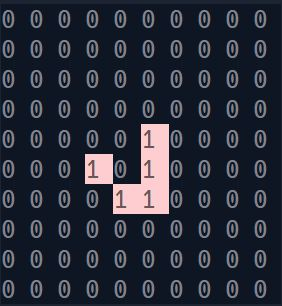

# Check out The Game of Life made in C#

## What is The Game of Life
The Game of Life is a type of cellular automaton that takes place on a never-ending rectangular grid made up of individual cells. Each cell can either be alive or dead, and its status is updated every turn based on the status of its eight neighbors. The neighbors of a cell include all adjacent cells, whether they are located vertically, horizontally, or diagonally from the cell in question.

The starting pattern is considered the first generation, and subsequent generations are created by applying the rules to every cell on the board at the same time. The rules are straightforward and determine the status of each cell in the next generation. Births and deaths occur simultaneously. This process is repeated for future generations.

## Rules
1. If the cell is alive, then it stays alive if it has either 2 or 3 live neighbors

2. If the cell is dead, then it springs to life only in the case that it has 3 live neighbors
